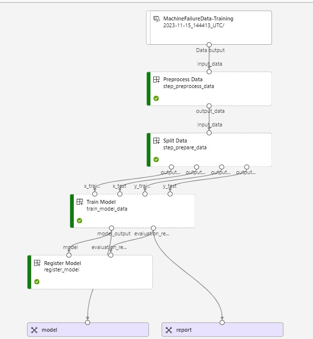
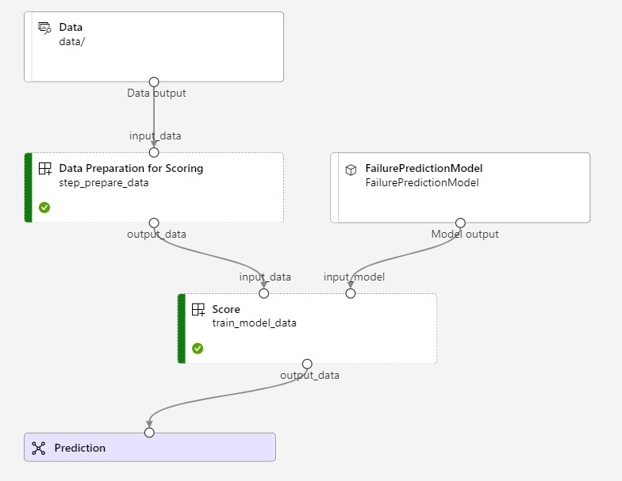

# Anticipatory Maintenance System

## Overview
Machine failures can result in significant downtime and high maintenance costs. This project addresses these challenges by building an **Azure Machine Learning pipeline** for real-time training, scoring, and inference to predict machine failures. By anticipating failures, businesses can:

- Extend equipment lifespan.
- Minimize downtime.
- Reduce maintenance costs.
- Optimize operational efficiency by making informed decisions on production planning and resource allocation.


---

## Built With
[](https://www.python.org/)
[](https://scikit-learn.org/)
[](https://azure.microsoft.com/)
[](https://mlflow.org/)

---

## Azure ML Pipeline Setup
### Steps:
1. **Azure ML Workspace:**
   - Create an Azure Machine Learning workspace [here](https://ml.azure.com/).
   - Note your workspace name and resource group.

2. **Compute Resources:**
   - Configure compute resources for training and deployment.
   - Update the `config.json` file with workspace details.

3. **Environment:**
   - Use `conda_dependencies.yml` to define the environment and dependencies.

4. **Pipeline Scripts:**
   - Implement training and scoring workflows using Azure ML SDK.
   - Scripts:
     - **Training & Evaluation:** `deploy-train.py`
     - **Scoring:** `deploy-score.py`

5. **Execution:**
   ```bash
   python deploy-train.py  # Train and evaluate the model
   python deploy-score.py  # Score new data
   ```

---

## Key Features
- **Proactive Maintenance:** Predict failures before they occur.
- **Operational Efficiency:** Reduce unplanned downtime and optimize resource allocation.
- **Scalable Model Management:** Use MLflow for model tracking and deployment.
- **User-Friendly Scripts:** Simple execution of training, scoring, and result evaluation.

---

## Approach
The predictive model is based on **Random Forests** implemented using **scikit-learn**. The machine learning lifecycle is managed with **MLflow** and **Azure Machine Learning Services** for robust, scalable solutions.

### Pipeline Visualization:
#### Training Pipeline:


#### Scoring Pipeline:


---

## Local Setup
1. Clone the repository:
   ```bash
   git clone https://github.com/Hypatchia/MachineFailure-Scikitlearn-Mlflow.git
   cd MachineFailure-Scikitlearn-Mlflow
   ```

2. Install dependencies:
   ```bash
   pip install -r requirements.txt
   ```

3. Set up `config.json` with your Azure credentials.

4. Run local EDA:
   - Open `EDA.ipynb` for exploratory data analysis.

5. Trigger training:
   ```bash
   python deploy-train.py
   ```

6. Score new data:
   ```bash
   python deploy-score.py
   ```

---

## Contact
Feel free to connect or reach out for collaboration!

[](https://www.linkedin.com/in/raj-purohith-arjun-20a652200/)  
[](mailto:raj2001@tamu.edu)  
